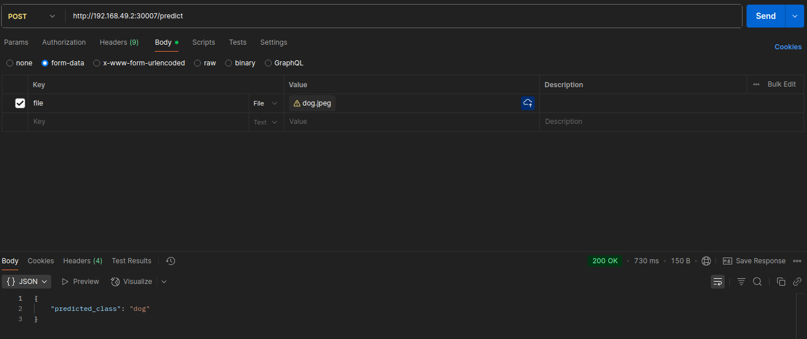

# MLOps
Goal is to built and deploy the image classifier with minikube.

- **demo**


# Run with minikube
Minikube is tool which allows to run local kubernetes clusters for testing and development purpose. Here are steps required to with minikube
- Install Docker from [here](https://docs.docker.com/engine/install/) according to your OS.
- Install minikube from [here](https://minikube.sigs.k8s.io/docs/start/?arch=%2Flinux%2Fx86-64%2Fstable%2Fbinary+download) according to your OS.
- build docker image using following 
```
docker build -t classifier:v1 .
```
- copy docker image from local machine to minikube. You can refer [this](https://medium.com/codex/how-to-use-local-docker-images-with-minikube-6dcf0ef05a2d) resource for detail.
```
minikube image load classifier:v1
```
- Check whether images copy to minikube.
```
minikube ssh
docker images
```
- Start minikube using following command
```
minikube start
```
- Run deployment and service yaml files
```
kubectl apply -f cnn-deployment.yaml
kubectl apply -f cnn-service.yaml
```
- run service
```
minikube service cnn-fastapi-service
```
Show following on terminal
```
|-----------|---------------------|-------------|---------------------------|
| NAMESPACE |        NAME         | TARGET PORT |            URL            |
|-----------|---------------------|-------------|---------------------------|
| default   | cnn-fastapi-service |          80 | http://192.168.49.2:30007 |
|-----------|---------------------|-------------|---------------------------|
🎉  Opening service default/cnn-fastapi-service in default browser...
```